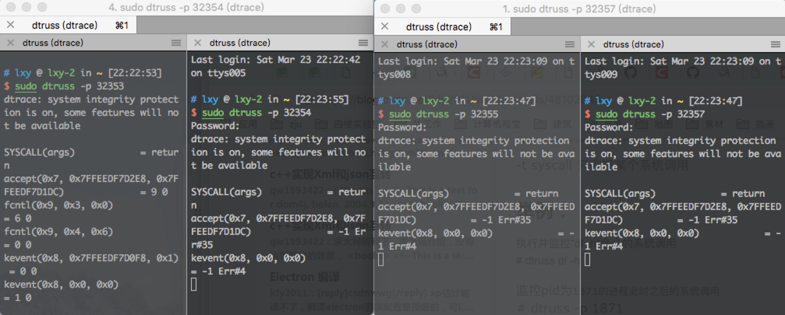

#### 步骤1.读取配置文件
    - 单例模式(double check 但是未加锁，因为配置文件只在main函数开始时执行)
#### 步骤2.环境变量搬家
    - 因为argv和environ是处于栈底之上，所以如果要修改进程的名称（即COMM），为了避免修改了environ，必须要将环境变量搬家。
#### 步骤3.日志系统
    - 使用了log4cpp 的日志库， 基于 Meyer Singleton的单例模式，log4cpp是线程安全的，并且该库本身所占用内存很少。
    - 使用了可变参数的机制，使用vsprintf进行拼接可变参数。[可变参数的使用方式， va_list , va_start, va_end]
#### 步骤4.进程处理信号
    - 核心使用函数 sigaction(), sigsuspend(), sigprocmask();
#### 步骤5.master进程开启worker进程
    -  fork()， 之后主进程通过sigsuspend()专门等着监听信号，子进程循环执行着
    - 注意设置为守护进程：
        - (1)调用umask(0); umask是个函数，用来限制（屏蔽）一些文件权限的。
	    - (2)fork()一个子进程(脱离终端)出来,然后父进程退出( 把终端空出来，不让终端卡住)；固定套路
	        fork()的目的是想成功调用setsid()来建立新会话，目的是

	        子进程有单独的sid；而且子进程也成为了一个新进程组的组长进程；同时，子进程不关联任何终端了；
	    - (3) 将输入、输出文件描述父重定向到/dev/null；用dup2  
    - 注意避免子进程被杀掉之后成为僵尸进程，需要父进程（master进程 监听信号 SIG_CHLD, 然后waitpid()）
#### 步骤6.worker进程开始端口监听
    socket() -> setsockopt() -> fcntl() -> bind() -> listen()
    设置socket()套接字 -> 设置ipv4,SO_REUSEADDR -> 设置非阻塞 -> 绑定监听端口 -> 监听端口
    ip和端口号要进行htonl(),htons()将本机序转化成网络序实现
    reactor反应堆模式
    macos:  采用kqueue
    liunx:  采用epoll
    

#### 步骤7.worker进程开启多线程
    done

#### 步骤8.线程池的分配和处理
    注意：所有的Kevent_Node 都要通过free_link进行回收，因为当FD_Node里面还是什么地方的Kevent_node不用的时候，都需要调用free_link->insertNode()
    done

#### 步骤9.worker进程处理业务
    接收数据-done
    发送数据-done
#### 步骤10.解析http报文
    使用[http-parser](https://github.com/nodejs/http-parser)：
    http://www.voidcn.com/article/p-kbvcufwq-tt.html
    -  无依赖性
    - 可以处理持久消息(keep-alive)
    - 支持解码chunk编码的消息
    - 支持Upgrade协议升级(如无例外就是WebSocket)
    - 可以防御缓冲区溢出攻击
    用法很简单：
    一个关键函数调用：
    两个关键设置：

#### 步骤11.静态服务器搭建
    - HTTP REQUEST中的GET解析，请求具体的html文件，参考nginx的配置
    - lucia.conf 的解析需要更进一步的处理

#### 步骤12.解析图片

#### 备注：
待解决的问题：

- 进程重启，datapoll里面的数据可能会丢失掉，所以要有两种重启的方式，暴力重启和温和重启。
- 惊群效应
- 线程资源池的回收再利用需要延迟吗？需要考虑一下

注意：
- log4cpp 存在内存泄漏
- 内存泄漏验证方式：
    - valgrind --tool=memcheck --leak-check=summary --trace-children=yes --show-reachable=yes ./lucia
